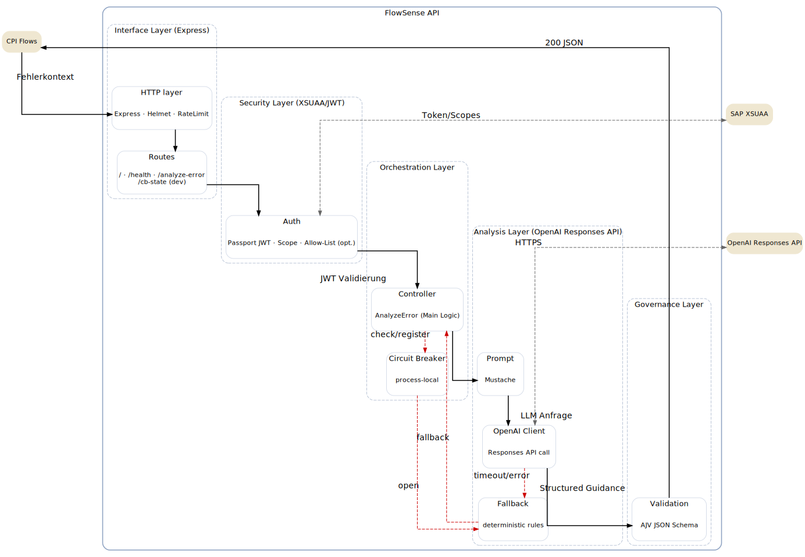
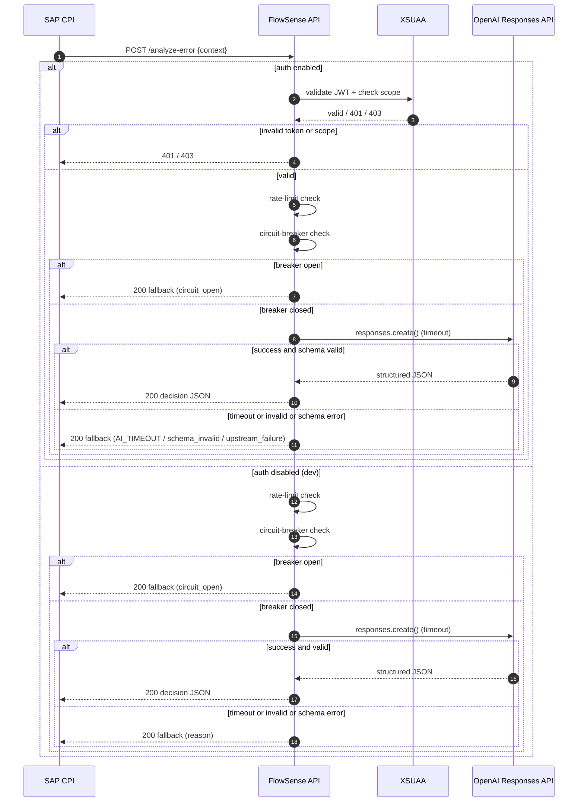

## 1) Purpose & Scope

**Zweck:** Semantische Fehlerklassifikation für Integrationsflüsse (z. B. SAP CPI).  
**Scope:** Eine schlanke HTTP-API, die Fehlerkontext entgegennimmt, mit einem LLM analysiert und **strukturierte, schema-validierte JSON-Entscheidungen** zurückgibt.

**Nicht-Ziele (Non-Goals):**
- Keine Persistenz von Kundendaten/PII in der API
- Kein langfristiger State (Retry/Audit liegt beim Client, z. B. CPI DataStore)
- Kein API-Management/Gateway: wird vorgelagert empfohlen, ist nicht Teil dieses Repos

---

## 2) High-Level Architecture

- **Interface Layer (Express):** Endpunkte `/`, `/health`, `/analyze-error`, optional `/cb-state`
- **Security Layer (XSUAA/JWT):** OAuth2 Client Credentials, Scope-Enforcement, optional Allow-List
- **Orchestration Layer:** Controller-Ablauf, Circuit-Breaker-Gate
- **Analysis Layer (OpenAI Responses API):** Prompt-Aufbereitung, Aufruf mit Timeout
- **Governance Layer:** AJV-Validierung (JSON-Schema), deterministischer Fallback, Rate-Limiting
- **Deployment Layer (SAP BTP CF):** `manifest.yml`, env-basierte Konfiguration





---

## 3) Komponenten

**3.1 Interface Layer (HTTP API)**

* **Framework:** Node.js (18+) / Express
* **Endpunkte:** `GET /` (Meta), `GET /health` (Liveness), `POST /analyze-error` (Kernfunktion), `GET /cb-state` (nur Dev; `EXPOSE_DEBUG_ENDPOINTS=true`)
* **OpenAPI:** vollständige Spezifikation in `../openapi.yaml`
* **Runtime (Kurzablauf):**

  1. `POST /analyze-error` (*Fehlerkontext*)
  2. Auth (JWT + Scope + optionale Allow-List)
  3. CB `checkOpen()` → wenn offen: **Fallback** (200)
  4. Prompt rendern → OpenAI Responses API (Timeout T)
  5. AJV validate() → gültig: **200 JSON (LLM)**
  6. Timeout/Fehler/Invalid → `registerFail()` → **Fallback** (200)

**3.2 Security Layer (XSUAA/JWT)**

* **Modi:** Dev (`DISABLE_AUTH=true`), Stage/Prod (OAuth2 Client Credentials via XSUAA)
* **Scopes:** `<XSAPPNAME>.flowsense.execute`
* **Durchsetzung:** Passport JWT Strategy + Scope-Middleware, optional `ALLOWED_CLIENT_IDS`
* **Details:** `./security.md`

**3.3 Orchestration Layer (Controller & Circuit Breaker)**

* **Controller:** steuert Ablauf, normalisiert Antwort, keine internen Fehler nach außen
* **Circuit Breaker (prozess-lokal):** `CB_THRESHOLD`, `CB_COOLDOWN_MS`; Dev-Einblick via `/cb-state`

**3.4 Analysis Layer (OpenAI Responses API)**

* **Inputdaten:** Flow, Step, TargetSystem, HTTP-Status, Fehlermeldung, Attempts, Timestamp
* **Templating:** schlankes Prompt-Template (deterministische Instruktionen)
* **Timeout/Modell:** `OPENAI_TIMEOUT_MS` (Default 8000 ms), `OPENAI_MODEL` (Default `gpt-4o-mini`)
* **Ergebnis:** strukturierte JSON-Antwort → AJV-Validierung

**3.5 Governance Layer (Robustheit)**

* **AJV:** strikte Schema-Validierung (Required/Typen/ggf. Enum, `no additionalProperties`)
* **Fallback:** deterministische Heuristik bei Timeout/Invalid/CB-open
* **Rate-Limiting:** z. B. 120 Requests / 60 s pro Route → Betriebsaspekte: `./operations.md`


---

## 4) Request Lifecycle (Runtime View)

1. **Ingress:** Client (z. B. CPI) ruft `POST /analyze-error` (JSON) auf.  
2. **Auth:** (Prod) JWT geprüft, Scope erzwungen; optional Allow-List.  
3. **Rate Limit:** Eingehende Requests pro Route begrenzt (hartcodiert).  
4. **Circuit Breaker:** Wenn offen ⇒ sofort Fallback; sonst weiter.  
5. **OpenAI Call:** Responses API mit Timeout.  
6. **Validation:** AJV prüft Response strikt gegen Schema.  
7. **Decision:** Gültige Antwort → 200 JSON; ungültig/Timeout → Fallback JSON (200).  
8. **Logging:** Structured Log (Empfehlung) inkl. Entscheidung/Signale.

> **Hinweis:** Request-Payloads werden nicht per AJV validiert (Prämisse: server-to-server, bekannter Client).  
  Input muss JSON sein; inhaltliche Plausibilität bleibt beim Client (z. B. CPI).

---


## 5) Datenverträge (Contracts)

### 5.1 Request (vereinfachter Auszug)
```json
{
  "flow": "OrderToCash",
  "stepName": "Map_Pricing",
  "targetSystem": "PricingService",
  "httpStatus": "502",
  "errorMessage": "Bad Gateway",
  "attempts": 1,
  "timestamp": "2025-08-24T10:50:11Z"
}
```

### 5.2 Response (vereinfachter Auszug; Schema in OpenAPI)
```json
 {
  "flow": "OrderToCash",
  "type": "connectivity",
  "description": "HTTP 502 while calling PricingService.",
  "root_causes": ["Upstream service downtime"],
  "suggested_fix": ["Retry with backoff"],
  "retry_hint": { "allowed": true, "after_seconds": 120, "max_attempts": 3 },
  "requires_manual": false,
  "signals": {
    "http_status": "502",
    "target_system": "PricingService",
    "step": "Map_Pricing"
  }
}
```

→ Vollständige Spezifikation: [`../openapi.yaml`](../openapi.yaml)

---

## 6) Konfiguration (ENV)

Minimum für Prod:
- `OPENAI_API_KEY`
- `OPENAI_MODEL` (optional, Default `gpt-4o-mini`)
- `OPENAI_TIMEOUT_MS` (Default 8000)
- `DISABLE_AUTH=false`
- XSUAA Service-Binding (Scope `<XSAPPNAME>.flowsense.execute`)

Resilienz/Governance:
- `CB_THRESHOLD` (Default 3)
- `CB_COOLDOWN_MS` (Default 60000)
- `EXPOSE_DEBUG_ENDPOINTS` = `false` (Prod)

→ Siehe [`./operations.md`](./operations.md)

---

## 7) Qualitätsmerkmale & Constraints

- **Determinismus:** Jede Antwort ist schema-validiert; Fallback ist vordefiniert.
- **Statelessness:** Keine Persistenz in der API; Scale-out unkritisch, CB aber pro Instanz.
- **Sicherheit:** Security-by-default (Debug off, Scope-Enforcement), Secrets nie im Repo.
- **Beobachtbarkeit:** Structured Logging empfohlen; Healthcheck nur Liveness.

---

## 8) Entscheidungen & Referenzen

- **ADR-0001:** [Circuit Breaker pro Instanz](./adr/ADR-0001-circuit-breaker-per-instanz.md)  
- **ADR-0002:** [Debug-/State-Endpunkte via Feature-Flag](./adr/ADR-0002-debug-endpoints-feature-flag.md)  
- **Security:** [`./security.md`](./security.md)  
- **Operations:** [`./operations.md`](./operations.md)  
- **Troubleshooting:** [`./troubleshooting.md`](./troubleshooting.md)

