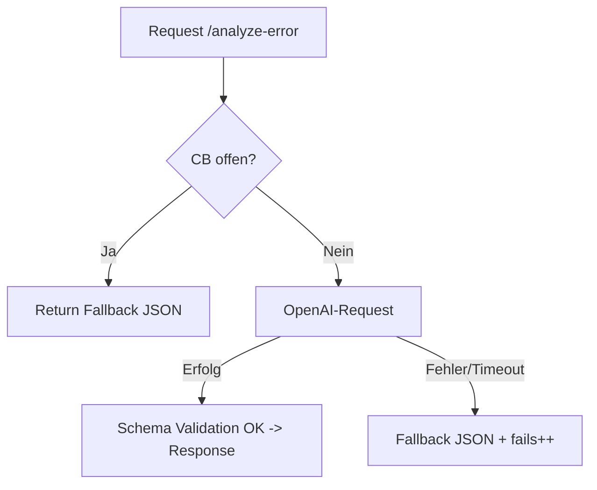

# Operations Guide — FlowSense API

Dieses Dokument beschreibt die betrieblichen Aspekte der FlowSense API: Start, Stop, Konfiguration, Monitoring und Resilienz.  
Stand: September 2025 · Version 1.1.0

---

## 1) Start & Stop

### Lokal (Dev-Modus)

```bash
npm run dev
```

* Startet auf Port 3000 (oder `PORT` aus `.env`)
* Auth deaktiviert (`DISABLE_AUTH=true` gesetzt)

### Lokal (Prod-Modus, simuliert)

```bash
npm start
```

* Erwartet gültige XSUAA-Konfiguration (Service Keys oder `.env`)
* Auth aktiv

### Cloud Foundry (SAP BTP)

```bash
cf target -a https://api.cf.<region>.hana.ondemand.com -o <org> -s <space>
cf push -f manifest.yml
```

* Instanz läuft mit Auth & XSUAA
* Logging via `cf logs flowsense-api --recent`
* Hinweis: `manifest.yml` muss zwingend **services:** (XSUAA-Bindung), **memory-limits** und **buildpack** enthalten.

---

## 2) Ports & Endpunkte

* **PORT:** Default 3000 (`.env` überschreibbar)
* **/** — Root-Endpoint mit minimalen Metadaten
* **/health** — Liveness Check (`{ "status": "ok" }`, prüft **nicht** OpenAI/Downstream)
* **/analyze-error** — Haupt-Endpoint (POST, JSON Payload)
* **/cb-state** — Dev-only (nur bei `EXPOSE_DEBUG_ENDPOINTS=true` sichtbar)

---

## 3) Environment-Variablen (Operational View)

| Variable                   | Zweck                                 | Default     |
| -------------------------- | ------------------------------------- | ----------- |
| PORT                       | Server-Port                           | 3000        |
| NODE_ENV                   | Umgebung (`development`/`production`) | development |
| DISABLE_AUTH               | Auth-Bypass für Dev (`true`/`false`)  | false       |
| EXPOSE_DEBUG_ENDPOINTS     | Debug-Endpoints (z. B. `/cb-state`)   | false       |
| OPENAI_API_KEY             | API Key für OpenAI                    | –           |
| OPENAI_MODEL               | Modell (Responses API)                | gpt-4o-mini |
| OPENAI_TIMEOUT_MS          | Timeout für LLM-Call (ms)             | 8000        |
| CB_THRESHOLD               | Fehleranzahl vor CB-Öffnung           | 3           |
| CB_COOLDOWN_MS             | Cooldown-Dauer (ms)                   | 60000       |
| FS_MAX_ATTEMPTS_DEFAULT    | Max. Versuche im Fallback (retry)     | 6           |

### Rate Limiting

Pro Route sind **120 Requests pro 60 Sekunden** erlaubt (hartcodiert).  
**Hinweis:** Nicht per ENV konfigurierbar; Anpassung erfordert Code-Änderung in `server.mjs`.

---

## 4) Logging & Monitoring

### Lokal

```bash
npm run dev
```

→ Logs auf stdout

### Cloud Foundry

```bash
cf logs flowsense-api --recent
```

### Logfelder (empfohlen)

* `flow` (String)
* `step` (String)
* `http_status` (String/Int)
* `decision` (z. B. type, retry, manual)
* `error` (Timeout, Schema invalid, Upstream failure)

> **Empfehlung:** JSON-basiertes Structured Logging für Betrieb & Alerting.  
> Inkl. Events für **CB open/close**, **Fallback ausgelöst**, **Schemafehler**.

**Beispiel-Logeintrag:**
```json
{
  "timestamp": "2025-09-09T08:11:45Z",
  "flow": "OrderToCash",
  "step": "Post_SalesOrder",
  "http_status": "502",
  "decision": "retry",
  "correlation_id": "abc-123"
}
```

### Monitoring

* Healthcheck über `/health` (nur Liveness; kein Downstream-/OpenAI-Check)
* Optional: Integration mit **SAP BTP Alert Notification Service** (z. B. bei HTTP-5xx-Peaks)
* Logs können an zentrale Plattformen wie **BTP Log Service, ELK, Splunk** weitergeleitet werden.

---

## 5) Resilience (Timeout, Fallback, Circuit Breaker)

**Timeout**

* OpenAI-Call hat einen konfigurierbaren Timeout: `OPENAI_TIMEOUT_MS` (Default: 8000 ms).
* Bei Timeout wird **kein** zweiter Versuch in der API gestartet (Retry liegt beim Client).

**Circuit Breaker (prozess-lokal)**

* Öffnet nach `CB_THRESHOLD` aufeinanderfolgenden Fehlern (Default: 3).
* Bleibt für `CB_COOLDOWN_MS` (Default: 60000 ms) offen.
* In der offenen Phase werden **keine** OpenAI-Requests gesendet; stattdessen liefert die API sofort eine **Fallback-Response (HTTP 200)**.

**Fallback-Response (Beispiel)**

```json
{
  "flow": "UnknownFlow",
  "type": "connectivity",
  "description": "Rule-based decision (upstream_failure) for status 0",
  "root_causes": ["upstream_failure", "http_status=0"],
  "suggested_fix": [
    "Retry with exponential backoff",
    "Check downstream health & credentials"
  ],
  "retry_hint": { "allowed": true, "after_seconds": 60, "max_attempts": 6 },
  "requires_manual": false,
  "signals": { "http_status": "0", "target_system": "", "step": "" }
}
```

**Flowchart (CB-Entscheidung):**


**Hinweis**  
`/cb-state` zeigt `{ open, fails, openUntil }`, ist aber **nur** verfügbar, wenn `EXPOSE_DEBUG_ENDPOINTS=true`.  
In Produktion nicht exponieren.

---

## 6) Fehlerbehebung (Common Issues)

### AI_TIMEOUT

* Ursache: LLM-Service antwortet nicht rechtzeitig
* Verhalten: Fallback (rule-based), kein manueller Eingriff nötig

### Schema Invalid

* Ursache: LLM-Antwort entspricht nicht dem JSON-Schema
* Verhalten: Fallback-Response (rule-based)

### 401 Unauthorized

* Ursache: falsches oder fehlendes Token
* Prüfen:

  * XSUAA-Service Key
  * Scope `<XSAPPNAME>.flowsense.execute`
  * CPI OAuth Setup
  * Falls Allowlist aktiv: Client-ID gegen `ALLOWED_CLIENT_IDS` prüfen

> **Weitere Fehlerbilder:** siehe [`docs/troubleshooting.md`](./troubleshooting.md).

---

## 7) Deployment-Hinweise (Cloud Foundry)

* Region setzen:

```bash
cf target -a https://api.cf.<region>.hana.ondemand.com -o <org> -s <space>
```

* Secrets **immer** via **Service Keys** bereitstellen; keine `.env` in Produktion
* Manifest prüfen (`manifest.yml`):

  * Instanzgröße
  * Memory-Limits
  * Buildpack: `nodejs_buildpack`
  * **services:** Abschnitt für XSUAA-Bindung

---

## 8) Betriebsrichtlinien

* **Dev:** `npm run dev`, Auth aus, Debug-Endpoints optional
* **Stage/Prod:** `npm start`, Auth aktiv, Debug-Endpoints **nicht** aktiv
* **Health:** `/health` für Liveness-Probes (z. B. CF Healthcheck)
* **CB-State:** nur Dev → nicht in Prod exponieren
* **Auth:** In Prod muss `DISABLE_AUTH=false` gesetzt sein; Scope `flowsense.execute` erforderlich
* **Referenzen:** [`docs/security.md`](./security.md), [`docs/troubleshooting.md`](./troubleshooting.md), [`openapi.yaml`](../openapi.yaml)

